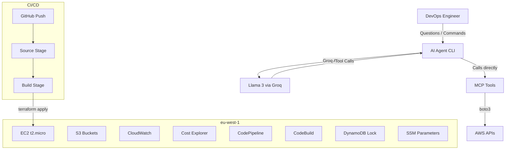

# AI DevOps Assistant

An AI-powered CLI agent that monitors AWS infrastructure and answers natural language questions about it. Built to demonstrate the integration of IaC, CI/CD, MCP, AI Agents, and AWS in a single coherent project.

> "How many EC2 instances are running?" → The agent calls real AWS APIs and tells you.

## Features

- **AI Mode** (Groq/Llama 3) — ask questions in natural language, the agent calls the right AWS tools automatically
- **Direct CLI Mode** — simple commands (`ec2`, `s3`, `cost`, `alarms`) without needing an AI key
- **MCP Server** — exposes AWS tools via Model Context Protocol (stdio transport)
- **Infrastructure as Code** — full Terraform setup for AWS resources
- **CI/CD Pipeline** — CodePipeline + CodeBuild for automated deployments

## Architecture



## Project Structure

```
ai-devops-assistant/
├── agent/
│   └── agent.py          # CLI agent (AI mode + direct mode)
├── mcp-server/
│   ├── server.py         # MCP server (stdio transport)
│   ├── config.py         # Secret retrieval (env vars / SSM)
│   └── tools/
│       ├── ec2.py        # EC2 list + metrics
│       ├── s3.py         # S3 bucket listing
│       ├── costs.py      # Cost Explorer monthly cost
│       └── cloudwatch.py # CloudWatch alarms
├── terraform/            # IaC for AWS infrastructure
├── Dockerfile            # Container build
├── buildspec.yml         # CodeBuild spec
└── requirements.txt      # Python dependencies
```

## Quick Start

### Prerequisites

- Python 3.11+
- Docker (for containerized run)
- AWS credentials (`aws configure` or env vars)
- (Optional) Groq API key for AI mode — free at https://console.groq.com

### Run with Docker

**AI Mode (natural language):**
```bash
docker build -t ai-devops-assistant .
docker run -it --rm --env-file .env ai-devops-assistant
```

**Direct CLI Mode (no AI key needed):**
```bash
docker run -it --rm \
  -e AWS_ACCESS_KEY_ID=your-key \
  -e AWS_SECRET_ACCESS_KEY=your-secret \
  -e AWS_DEFAULT_REGION=eu-west-1 \
  ai-devops-assistant
```

### Run locally (without Docker)

```bash
pip install -r requirements.txt
cd agent
python agent.py
```

### Environment Variables

| Variable | Required | Description |
|----------|----------|-------------|
| `AWS_ACCESS_KEY_ID` | Yes | AWS access key |
| `AWS_SECRET_ACCESS_KEY` | Yes | AWS secret key |
| `AWS_DEFAULT_REGION` | Yes | AWS region (default: `eu-west-1`) |
| `GROQ_API_KEY` | No | Enables AI mode (Llama 3 via Groq) |

### `.env` file example

```env
GROQ_API_KEY=gsk_your_key_here
AWS_ACCESS_KEY_ID=AKIA...
AWS_SECRET_ACCESS_KEY=your-secret
AWS_DEFAULT_REGION=eu-west-1
```

## Usage

### AI Mode
```
🤖 DevOps Assistant (Groq AI - Llama 3)
Tu: ec2
🤖 Ai 1 instanță EC2 (stopped) - t2.micro în eu-west-1a. Dorești mai multe detalii?
Tu: da
🤖 Instanța i-0d100... | CPU: 0% | Network: 0 bytes in/out (stopped)
```

### Direct CLI Mode
```
devops> ec2
EC2 Instances:
  • i-0d100ecc15d9e2162 | stopped | t2.micro | eu-west-1a

devops> s3
S3 Buckets:
  • ai-devops-assistant-pipeline-artifacts | eu-west-1 | 🔒 blocked

devops> cost
Cost June 2026: $0.42 USD
```

## Available Tools

| Tool | Description |
|------|-------------|
| `list_ec2_instances` | Lists all EC2 instances (id, state, type, AZ) |
| `list_s3_buckets` | Lists S3 buckets with public access status |
| `get_monthly_cost` | Current month's total AWS cost in USD |
| `get_cloudwatch_alarms` | All CloudWatch alarms with state |
| `get_ec2_metrics` | CPU, NetworkIn, NetworkOut for an instance (last 60 min) |

## Infrastructure (Terraform)

The `terraform/` directory provisions:
- VPC with networking
- EC2 instance (t2.micro)
- IAM roles and policies
- CodePipeline + CodeBuild for CI/CD
- S3 bucket for Terraform state
- DynamoDB table for state locking

Deploy with:
```bash
cd terraform
terraform init
terraform apply
```

## License

See [LICENSE](LICENSE) file.
